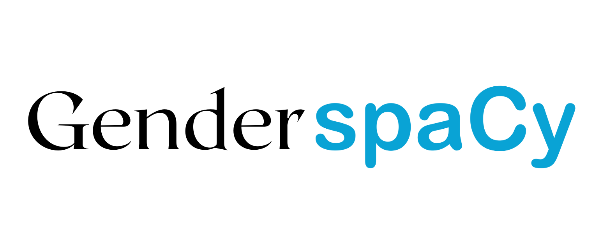
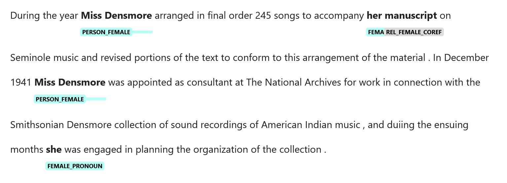

# Identifying Gender in Museum Archives with Machine Learning and Natural Language Processing

Part of the mission of the [American Women's History Initiative](https://womenshistory.si.edu/) is to understand better and more wholly the influential role women have played in the Smithsonian's history. There are many sources for this information, but in this blog we will be focusing on documents, or textual data.

Through natural language processing (NLP), we can automate the parsing of documents en masse. This is achieved by representing raw text as embeddings, or large numerical representation of words. These numbers contain semantic meaning of a text which makes it possible for a computer to understand what certain words mean in relation to other words in a given language. Today, this is done via machine learning.

We can also use machine learning to teach a computer system to identify and extract relevant material in sources, such as people, dates, places, etc. These are known as named entities. The identification of named entities is known as named entity recognition (NER). The results from an NER output should not be taken as 100% accurate, however. Mistakes will remain. It is important to perform manual validation of the outputs; nevertheless, manual validation takes far less time than manually tagging all entities in a given text.

There are many off-the-shelf machine learning models that can perform NER and find relevant information for researchers. As it stands, however, there is no reliable and ethical way to identify a person's gender within a text. This blog introduces the ethical and computational challenges to solving such a problem. It also presents a new solution to this issue that we have developed in the Smithsonian Institution's [Data Science Lab](https://datascience.si.edu/).

## Background

This project stems from postdoctoral work with the American Women's History Initiative. Part of this project was a collective exploration of the role of women in science at the Smithsonian since its inception.

[The Data Science Lab team explored various solutions for identifying known women in its archives and in specimen record collections](https://womenshistory.si.edu/stories/using-data-science-uncover-work-women-science). We noticed that women's identities were frequently masked in several ways. First, many women in science at the Smithsonian were the spouses of full-time employees. The contributions of these women are sometimes masked, or hidden, by the name of their respective spouses. In one such construction, a woman could have her named associated with her husband's first and last name, as in the following example.

`Mrs. Martha and Mr. Mark Smith`.

Here, we can clearly identify `Mrs. Martha Smith` as a human, but doing so computationally is not as simple. We need to parse out this construction in order to construct the `Mrs. Martha` to `Smith`.

In other instances, however, the issue was more complicated with her first name being entirely removed. We can see that with the following example:

`Mr. and Mrs. Mark Smith`

In cases like this, identifying the woman is not as clear. We would need to know that Mrs. Martha Smith was married to Mr. Smith. To resolve issues like this, we have been collating a database of women and their spouses so that we can potentially match examples like this to specific named women.

Another way in which a woman's identity is masked is through gender-neutral titles. For example, `Dr. Smith` could be `Dr. Martha Smith` or `Dr. Mark Smith`. In other cases, a woman's name could be hidden behind abbreviations, such as `M. Smith`. Again, this could refer to either Martha or Mark Smith. For cases such as these, we use gender-specific context to resolve the gender-neutral entity (see below).

These types of ambiguity not only cloud the role of women at the Smithsonian, it also directly discredits their own work. In 2019, [Tiana Curry](https://datascience.si.edu/news/whatsinaname), an intern at the Smithsonian, noticed that certain specimen collection records were assigned to Mr. Charles Walcott; but there was a problem. Some of these specimen records were dated to after his death. In this case (and others like it), attribution belonged to Walcott's widow, Mary Vaux Walcott, an accomplished scientist who had a clear pedigree with many specimens attributed to her.

## The Problem

Over the past year, we have explored various solutions for identifying women in Smithsonian records. There are several Python and R libraries available to researchers that will use an individual's first name and check it against the country of a document to output the likely gender of the individual. This presents certain serious practical and ethical issues. First, Smithsonian data spans many continents; it is not always easy to identify the country of origin for the entity identified. Second, the museum's records cover nearly two centuries of data. Name usage has changed significantly in that time. Third, and most problematic, is the ethical implications of assigning gender based on the statistical usage of a first name. It presumes far too much about the individual with far too little evidence.

## A Potential Solution

**It is important to note in the methods below we do not presume the gender of the individual through these approaches, rather we simply identify how that individual is referenced within the context of a given text. No data generated is used without manual validation. In other words, we do not presume the gender of the individual, rather identify the gender used in a given text for that individual. This means that when we parse a document, we are identifying the individual's gender as the author represents it. This means if the author identifies a specific individual with the pronoun `her`, we presume that that individual is female, but it remains possible that the author made that assignment incorrectly.**

To solve this issue, we decided to take a context-based approach to identifying women. First, women often receive gender-specific honorofics (Mrs., Miss., Ms.). One component in our pipeline looks for these occurences using Regular Expressions (RegEx) to identify any time a gender-specific honorific is used in a text and followed by a sequence of proper nouns. When an entity is found in a text, we assign a gender-specific tag to that individual. If that individual is identified with female honorifics, we assign the label `FEMALE_PERSON`.

With this same logic, we perform the same task on what we are calling `COLLECTIVE_SPOUSAL` entities, e.g. where a woman's name appears alongside that of her spouse, e.g. Mrs. and Mr. Smith.

As noted above, there are gender-neutral honorifics, such as  "Dr.". In these cases, we flag these individuals as `PERSON_UNKNOWN`.

Next, we use a machine learning model to identify all other individuals in the text. Since we work with the [spaCy](https://spacy.io/) framework, we look for all entities labeled as `PERSON`. We then assign these entities the label of `PERSON_UNKNOWN`.

In addition to this, we identify all gender pronouns in a text and flag them with a gender-specific label, e.g. `FEMALE_PRONOUN`.

Finally, we use a coreference resolution model to then examine the text. Coreference resolution is the clustering of spans, or words, in a document. It matches antecedents and postcedents to heads. Consider the following text:

```
"Anna plays the violin. She likes music."
```

In this case "she" is a pronoun that refers back to "Anna". In coreference resolution, we match these two separate words together as being a cluster of words that represent the same entity.

In our workflow, we look for the usage of a gender-specific pronoun alongside all proper nouns in these clusters. If that proper noun has a label of `PERSON_UNKNOWN` and aligns with a gender-specific pronoun, we assign a gender-specific label that indicates this label derived from a coreference machine learning model, e.g. `FEMALE_PERSON_COREF`. This is important because these are the attributions that require a closer look.

## Introducing Gender spaCy

In the process of designing this workflow, we also considered the broader applications of such a pipeline. The result is [Gender spaCy](https://github.com/sidatasciencelab/gender-spacy), an open-source Python library built on spaCy for identifying gender-specific data in texts.



Gender spaCy allows users with just two lines of Python to automate the parsing of documents and identifying gender-specific data within the text. With a third line, the data can be visualized as the image below demonstrates.



For those who do not have Python, there is even a free open-source [application in the cloud](https://gender-spacy.streamlit.app/).

By relying on gender-specific context (as opposed to assigning gender based on first names), Gender spaCy is more sophisticated than existing approaches to identifying and finding women in documents.

## Getting Started with Gender spaCy

To use Gender spaCy as a Python library, you will first need to install Python on your system. It is important to use Python version 3.9 or higher. While it may work on lower versions of Python, we did not test it on these systems. We have also tested Gender spaCy on Windows 10, Ubuntu 20.04 (Linux), and Mac M1. It should, therefore, work with most operating systems and computer builds.

Once you have installed Python, it may be necessary to create a new environment. This is because Gender spaCy uses experimental features of spaCy. If you are using Anaconda, you can create a new environment with the following command:


```python
conda create --name="gender-spacy" python=3.9
```

Once you have created the environment, you will need to activate it. You can do so with the following command:


```python
conda activate gender-spacy
```

Next, install GenderSpaCy

```python
pip install gender-spacy
```

Finally, for the pipeline to perform coreference resolution, you should install the latest version of the spaCy experimental coreference resolution model.

```python
pip install https://github.com/explosion/spacy-experimental/releases/download/v0.6.0/en_coreference_web_trf-3.4.0a0-py3-none-any.whl
```

With all of this in place, you can now begin working with Gender spaCy in code.

## Usage

```python
# import the library
from gender_spacy import gender_spacy as gs

# create the GenderParser nlp class.
# This will take one argument: the spaCy model you wish to use
nlp = gs.GenderParser("en_core_web_sm")

# create a text and pass it to the the nlp via the process_doc() method.
text = """
Maya Angelou was an American memoirist, popular poet, and civil rights activist. She published seven autobiographies, three books of essays, several books of poetry, and is credited with a list of plays, movies, and television shows spanning over 50 years.

Jerome Allen Seinfeld is an American stand-up comedian, actor, writer, and producer. He is best known for playing a semi-fictionalized version of himself in the sitcom Seinfeld (1989–1998), which he created and wrote with Larry David.
"""
doc = nlp.process_doc(text)

# perform coreference resolution on the doc container
# This part of the library comes from spacy-experimental
doc = nlp.coref_resolution()
```

##  Visualize the result:

```python
nlp.visualize()
```

Once you run this command, you should see an output like the following image:


# CITATIONS
Source for gender pronouns: https://uwm.edu/lgbtrc/support/gender-pronouns/

Source for Coreference Resolution: https://explosion.ai/blog/coref

Discussion for Coref Code: https://github.com/explosion/spaCy/discussions/11585